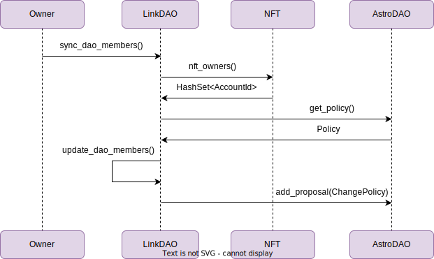

The repository contains the implementation of two contracts: Non-fungible Token and LinkDAO contract. LinkDAO allows synchronizing NFT ownership with DAO membership. This will enable NEAR NFT communities to form governance structures based on ownership of an NFT, similar to [NounsDAO](https://nouns.wtf/).

Non-fungible Token (NFT)
===================

This repository includes an implementation of a [non-fungible token] contract which uses [near-contract-standards] and workspaces-js and -rs tests.

  [non-fungible token]: https://nomicon.io/Standards/Tokens/NonFungibleToken/
  [near-contract-standards]: https://github.com/near/near-sdk-rs/tree/master/near-contract-standards

## Explore this contract

The source for this contract is in `nft/src/lib.rs`. It provides methods to manage access to tokens, transfer tokens, check access, and get token owner. Contract stores all NFT holders in additional field which is updated every time mint or transfer occurs.

## Building this contract

Run the following to build rust project up via cargo. This will generate our WASM binaries into our `res/` directory. This is the smart contract that will be deployed onto the NEAR blockchain later.

```bash
./scripts/build.sh
```

## Testing this contract

Run the following commands to verify that contract code is working.

*Unit Tests*
```bash
cd nft
cargo test -- --nocapture
```

*Integration Tests*
*Rust*
```bash
cd integration-tests/rs
cargo run --example integration-tests
```
*TypeScript*
```bash
cd integration-tests/ts
yarn && yarn test 
```

## Using this contract

### Quickest deploy

```bash
near dev-deploy --wasmFile res/non_fungible_token.wasm
```

The next command will initialize the contract using the `new` method:

```bash
near call $CONTRACT_ID new '{"owner_id": "'$OWNER_ID'", "metadata": { "spec": "nft-1.0.0", "name": "Tonic Greedy Goblins", "symbol": "GGB" }}' --accountId $CONTRACT_ID
```

To view the NFT metadata:

```bash
near view $CONTRACT_ID nft_metadata
```

Link DAO contract
===================

This smart contract connects NFT contract and AstroDAO contract in order to synchronize DAO members with NFT owners. 
It is done via Change Policy proposal as it allows updating all members at once.



## Prepare contract for syncing

1. Run the following to build contract. The result will be saved in `/res` directory.
```bash
./scripts/build.sh
```

2. Deploy contract.
```bash
near dev-deploy --wasmFile res/dao_contract.wasm
```

3. Initialize contract providing account ids for owner, NFT and AstroDAO contracts.

```bash
near call $CONTRACT_ID new '{"owner_id": "'$OWNER_ID'", "nft_contract_id": "'$NFT_CONTRACT_ID'", "dao_contract_id": "'$DAO_CONTRACT_ID'"}' --accountId $CONTRACT_ID
```

4. Set role for NFT holders that is used in AstroDAO contract.

```bash
near call $CONTRACT_ID set_dao_role '{"role": "'$ROLE'"}' --accountId $OWNER_ID
```

5. Sync two contracts. This will create a proposal to set policy with updated DAO members.
**Note:** it is required to have 0 bond value (min deposit amount) in AstroDAO policy.

```bash
near call $CONTRACT_ID sync_dao_members --accountId $OWNER_ID --gas 300000000000000
```